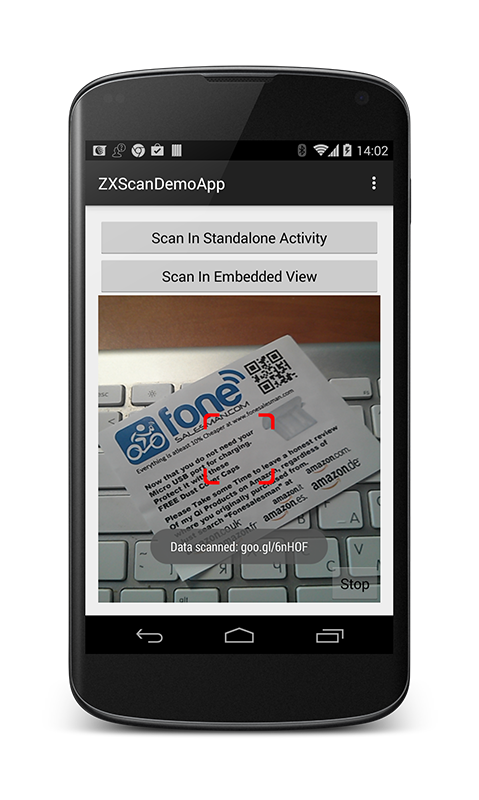

ZXScanLib for Android v2
========================

Android library for adding barcode scanning functionality into any Android app with ease.

The library uses ZXing and ZBar (at your choice) as core barcodes decoding engines and our own camera streaming library
and is very lightweight, customizable and extremely easy to embed into the application.



Status
------

Official status is: **UNSTABLE**. 

This is initial phase of v2 development - the code is not clean and any apis are not final and may change at any time without prior notice.


Usage
-----

Simply include `ScannerView` in your layout XML.

```xml
<eu.livotov.zxscan.ScannerView
    android:id="@+id/scanner"
    android:layout_width="match_parent"
    android:layout_height="match_parent" />
```

Add scanned code event receiver.

```java
ScannerView scanner = (ScannerView) findViewById(R.id.scanner);
scanner.setScannerViewEventListener(new ScannerView.ScannerViewEventListener()
{
            public boolean onCodeScanned(final String data)
            {
                scanner.stopScanner();
                Toast.makeText(this, "Data scanned: " + data, Toast.LENGTH_SHORT).show();
                return true;
            }
});
```

Start scanner when you need it.

```java
scanner.startScanner();
```

That't it ! Alternatively you may operate with the ScannerFragment instead. The only difference is that ScannerFragment
starts and stops scanner automatically when fragment is resumed/paused.

See also the simple demo application that is included.


Known Issues
------------

- Currently scanner tries to recognize all supported barcodes. Option to try only specified types will be added shortly.
- With ZXing engine (default), 1D barcodes are read when the barcode is placed vertically. This should be corrected later (if possible)
- ZBar engine is not yet available


Getting It
----------

ZXScanLib is available from maven repository:

- Maven repository: *http://maven.livotovlabs.pro/content/groups/public*
- Group name: *eu.livotov.labs*
- Artifact ID: *zxscanlib*

Available versions:

- Latest development snapshot: *2.0.0-SNAPSHOT*
- Latest stable version: *n/a*
- Previous generation version: *0.9.1*

*Please note that versions 0.9.x and 1.x are from previous generation of this library - they are completely different in api and obsolete.*

Gradle:

```groovy

repositories {
    ...
    maven { url 'http://maven.livotovlabs.pro/content/groups/public' }
    ...
}

compile ('eu.livotov.labs:zxscanlib:<VERSION_NUMBER>@aar') {transitive=true}

```

Note, that ZXScanLib depends internally on CAMView project, so ```transitive=true``` statement is required in order to compile.


Tweaking The Scanner
----------------

All configuration is made on ScannerView instance. If you're operating with ScannerFragment, you can get ScannerView instance by
calling ```getScanner()``` method.

- To enable or disable sound beep when the code is scanned, use ```setPlaySound(true|false);```
- To use your own sound for beep, set it using ```setScannerSoundAudioResource(R.raw.my_beep);``` - you can use .wav, .ogg or .mp3 files.
- To show or hide the HUD (red square above the picture from camera), use ```setHudVisible(true|false);```
- To use your own picture of HUD, set it using ```setHudImageResource(R.drawable.my_hud_image);```

If you want complete scanner layout rework, extend ScannerView and override the ```getScannerLayoutResource()``` method in order to
specify your own layout:

```java
public class MyScannerView extends ScannerView
{
    @Override
    protected int getScannerLayoutResource()
    {
        return R.layout.my_customized_scanner_layout;
    }
}
```

Note, that your layout **MUST** contain at least the ```CAMView``` object definition with the special ID ```zxscanlib_camera``` :

```xml
<eu.livotov.labs.android.camview.CAMView
            android:id="@id/zxscanlib_camera"
            android:layout_width="match_parent"
            android:layout_height="match_parent"/>
```


Contributing
------------

We're always happy for external help and any contributions !

- If you want to contribute to barcode scanning/recognition/customization area, please submit a ticket, fork the project, apply changes and submit a pull request.
- If you want to contribute to camera manager, you're welcome to do the same steps as above but for CAMView project: https://github.com/LivotovLabs/CAMView - it is used
internally in ZXScanLib for streaming and capturing live data from the device camera.


License
-------

    Copyright 2014 Livotov Labs Ltd.

    Licensed under the Apache License, Version 2.0 (the "License");
    you may not use this file except in compliance with the License.
    You may obtain a copy of the License at

       http://www.apache.org/licenses/LICENSE-2.0

    Unless required by applicable law or agreed to in writing, software
    distributed under the License is distributed on an "AS IS" BASIS,
    WITHOUT WARRANTIES OR CONDITIONS OF ANY KIND, either express or implied.
    See the License for the specific language governing permissions and
    limitations under the License.


 [zip]: https://github.com/LivotovLabs/zxscanlib/archive/master.zip

